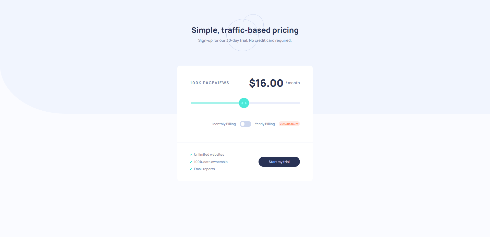

# Frontend Mentor - Interactive pricing component solution

This is a solution to the [Interactive pricing component challenge on Frontend Mentor](https://www.frontendmentor.io/challenges/interactive-pricing-component-t0m8PIyY8). Frontend Mentor challenges help you improve your coding skills by building realistic projects. 

Difficulty: Level 2 (Junior)

## Overview

### The challenge

Users should be able to:

- View the optimal layout for the app depending on their device's screen size
- See hover states for all interactive elements on the page
- Use the slider and toggle to see prices for different page view numbers

### Links

- Live Site URL: [https://jordansgit.github.io/interactive-pricing-component/](https://jordansgit.github.io/interactive-pricing-component/)

### Built with

- HTML5 
- CSS 
- JavaScript 

### Screenshot

Desktop 

Tablet

Mobile

